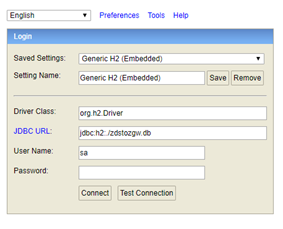

# Installatie

### Prerequisites

### Java

Java 11 or higher is needed to run the project. The project is tested with OpenJDK 11

### Lombok 

This project uses [Lombok](https://projectlombok.org/). No setup is required to run the application after building with Maven.
If compilation in an IDE is needed, setup may me applicable. 
Lombok plugins are available for all major Java IDE's ([examples](https://www.baeldung.com/lombok-ide))

### Installation ###

Clone the repo and build and run the service with Maven

```
$ git clone https://github.com/Haarlem/zds-stuf-to-zgw-api-translator/
$ cd zds-stuf-to-zgw-api-translator 
```

Use configuration from examples or provide local settings

```
$ mv src/main/resources/application.properties_example src/main/resources/application.properties
$ mv src/main/resources/config.json_example src/main/resources/config.json
```

Start the service

```
$ mvn spring-boot:run
```

The service is now available on port 8080 or the port provided in application.properties

#### Setup ZRC

This services depends on an implementation of [API standaard zaakgericht werken](https://www.vngrealisatie.nl/producten/api-standaarden-zaakgericht-werken)
The current version of this service is (partially) tested with [OpenZaak](https://github.com/open-zaak/open-zaak) as backend.

### Configuration

The application uses two configuration files, located in the resources folder. Examples are provided.

| File                   | Usage                                                  |
| ---------------------- | ------------------------------------------------------ |
| application.properties | Server settings like portnumbers and ZGW api url       |
| config.json            | Runtime configuration like zaaktypes, organisaties etc |

### Using the service

The service can receive and translate StUF ZDS 1.2 SOAP messages.
A list of supported operations and endpoints can be retrieved by accessing the url: http://localhost:8080/
The database can accessed by the following url: http://localhost:8080/h2-console/

Example SOAP messages are provided in the /examples/soap folder

### Minimale configuratie OpenZaakBrug

Voor de minimale inrichting zijn er de volgende randvoorwaarden aan het systeem:

- Java 11, getest met OpenJDK11
- Maven
- Git
- Internet verbinding voor git en maven

Ophalen en klaarzetten van de applicatie:

```
$ git clone https://github.com/Sudwest-Fryslan/OpenZaakBrug.git
```

```
$ cd OpenZaakBrug
```

```
$ mv src/main/resources/application.properties_example src/main/resources/application.properties
```

```
$ mv src/main/resources/config.json_example src/main/resources/config.json
```

Instellen van de applicatie, application.properties

Instellen van de applicatie, config.json

- openzaak.jwt.secret=test
- openzaak.jwt.issuer=test
- openzaak.baseUrl = https://openzaak.local

De endpoints goedzetten naar de juiste

Draaien van de service

```
$ cd OpenZaakBrug
$ mvn spring-boot:run
```

Update en draaien van de applicatie

```
$ cd OpenZaakBrug
$ git pull
$ mvn spring-boot:run
```

Na het draaien van de commando&#39;s zijn de services bereikbaar op:

- http://localhost:8080/translate/generic/zds/VrijBericht
- http://localhost:8080/translate/generic/zds/OntvangAsynchroon
- http://localhost:8080/translate/generic/zds/BeantwoordVraag

### Benaderen H2 database

De H2 (database) console is te bereiken op:

[http://localhost:8080/h2-console/login.jsp](http://localhost:8080/h2-console/login.jsp)



### Gebruik vanuit een backoffice applicatie

Hierna is het van belang om de client-applicatie aan te passen, in bijvoorbeeld Suite4SociaalDomein kan de functioneelbeheerder dit zelf doen in het volgende scherm:

Voor de basisurl zal dan http://%linuxserver%:8080/ gebruikt moeten worden

### Gebruik vanuit SoapUI

Binnen SoapUi kunnen dan de berichten verstuurd worden naar de volgende endpoints van de OpenZaakBrug. Een voorbeeld project valt te vinden in: examples\soap\Open-Zaakbrug-soapui-project.xml

### Vervolg actie vervangen van de database

Instellen van de applicatie, application.properties, het volgende blok aanpassen met instructies zoals deze te vinden zijn voor &quot;spring boot properties jpa&quot; met de betreffende database

(bvb h2/postgresqsl/mysql/oracle/mssql/..)

### Vervolg actie aanpassen modus naar koppeling OpenZaak

In de application.properties instellen waar openzaak zich bevind

- openzaak.jwt.secret=test
- openzaak.jwt.issuer=test
- openzaak.baseUrl = https://openzaak.local

### JWT enpoint

The project contains an enpoint that emits a valid JWT based on the secret provided in the properties file.
This can be used when using the ZGW API in tools like Postman. Only use this in test environments.
The enpoint is dissabled by default and can be enabled by setting:

```
nl.haarlem.translations.zdstozgw.enableJWTEntpoint = true
```
